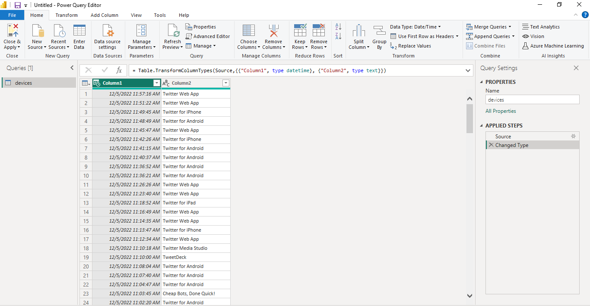
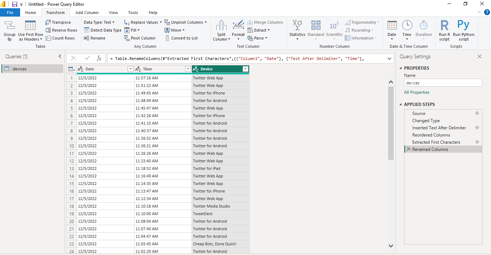
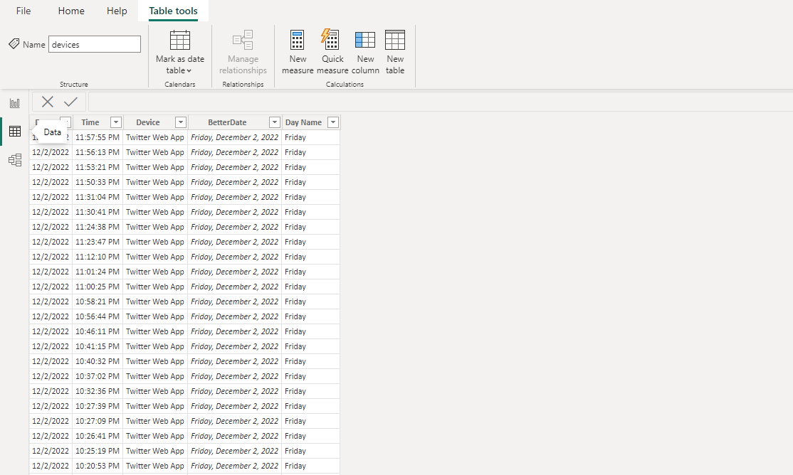
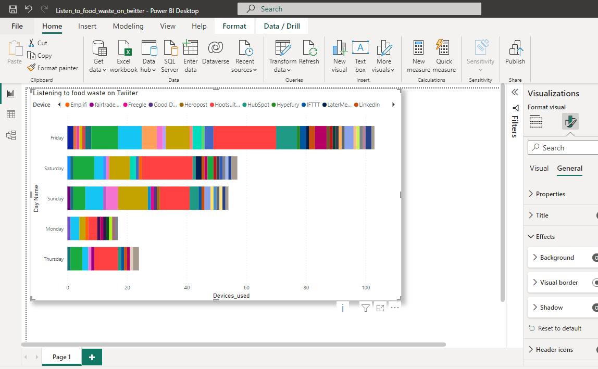

# Food waste
This is a mini-project to show Twitter Activity about Food Waste on Twitter for 5 days

## Data Aquistion using Twitter API
```python
import tweepy
from credentials import *
import csv #Import csv

auth = tweepy.auth.OAuthHandler(api_key,api_secret_key)
auth.set_access_token(ACCESS_TOKEN, ACCESS_TOKEN_SECRET)

api = tweepy.API(auth)

# Open/create a file to append data to
csvFile = open('devices2.csv', 'a')

#Use csv writer
csvWriter = csv.writer(csvFile)

#Pull 1000 Tweets not Retweets about Food waste in the English Language
for tweet in tweepy.Cursor(api.search_tweets,
                           q = "food waste -filter:retweets", 
                           lang = "en").items(1000):

    # Write a row to the CSV file. I use encode UTF-8
    csvWriter.writerow([tweet.created_at,tweet.source])

csvFile.close()
```

## Exploratory Analysis in SQL
-Had to create a database that will store the data from the Twitter API

```sql
create database food; 
```

-Opened mysql server from the Ubuntu Terminal
```bash
mysql  -u root -p
```

-Configure mysql server to allow data to be imported from files
```bash
SET GLOBAL local_infile=1;
```

-Quit
```bash
quit;
```
-Opened the mysql server to enable importation of Data through files

```bash
mysql --local-infile=1 -u root -p;
```
-Select the database to be used

```sql
use food;
```

-Created a table inside the 'food' database to store the data inside the 'device_action' table

```sql
create table device_action(
date varchar(50),
source varchar(50)
);
```

- Used the Ubuntu Terminal to import data from 'devices.csv' file into the table 'device_action'

```bash
LOAD DATA LOCAL INFILE '/home/jay/code/Data_analytics_projects/food_waste/devices.csv' INTO TABLE device_action FIELDS TERMINATED BY ',' ENCLOSED BY '"' LINES TERMINATED BY '\n' IGNORE 1 ROWS;
```

```sql

-- Look inside the table

select * from device_action;

```

```sql

-- How many tweets in totals

select count(source) from device_action;

--- 2650 devices were used to tweet about the Food waste

```

```sql

-- How many sources of Tweets are available

select  count(distinct source) as number_of_tweets from device_action; 

--- 108 different devices were used to tweet about Food waste

```
```sql

-- How many tweets were made from each of the different sources;

select source ,count(source) from device_action group by source;

-- Most Tweets were made from the 'Twitter Web App' and then followed by 'Twitter for iphone'
```

## Visualisation in Power BI
I imported the Food waste into the Power BI


Cleaned the Date Data into the Power Bi


Prepared the Data for visualization


Visualization of Food waste Data
